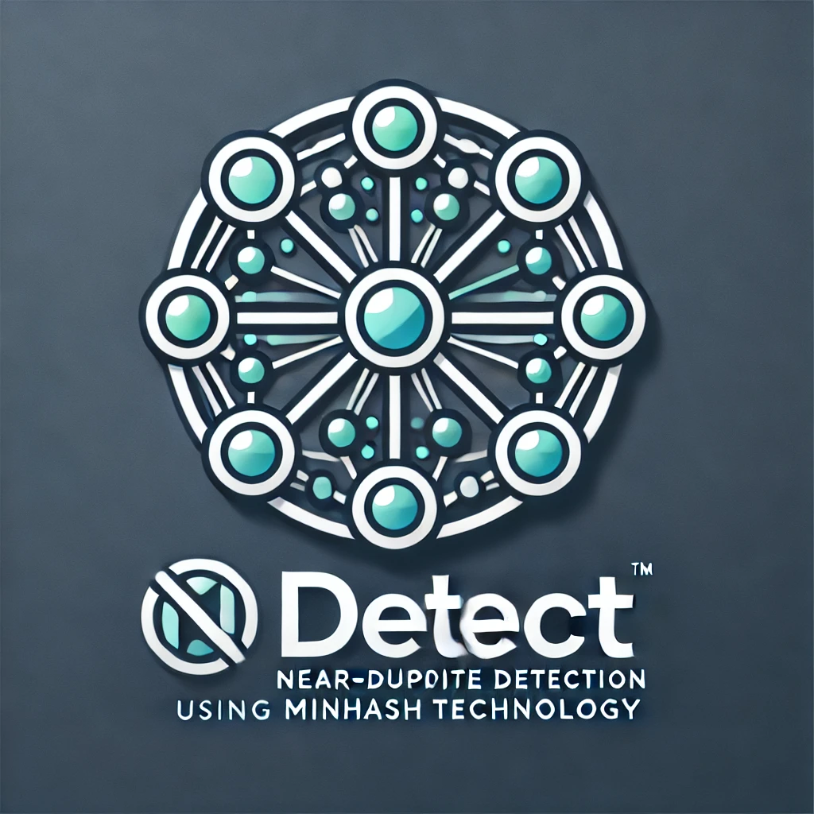

# `ndetect`: Near-Duplicate Detection using MinHash



(AI slop logo; disregard the "TM"!)

## Quickstart

### Install

#### Nix/flakes/direnv

```bash
git clone git@github.com:othercriteria/ndetect.git
cd ndetect
direnv allow
ndetect .
```

#### System Python (virtualenv)

```bash
git clone git@github.com:othercriteria/ndetect.git
cd ndetect
python -m venv .venv
source .venv/bin/activate
pip install -e .
ndetect .  # If installation was successful
# OR
python -m ndetect .  # Always works as long as package is installed
```

### Usage

There are enough text files in the repo to get started using the interactive mode.

## Core Behavior

### 1. Identify Near-Duplicates

- The tool identifies near-duplicate text documents based on their **content similarity**
  using MinHash.
- **Groups** of duplicates are formed by detecting transitive relationships (e.g., if
  A is similar to B and B is similar to C, all three form a group).

### 2. Modes of Operation

The tool operates in two primary modes:

1. **Interactive Mode** (default):
   - Groups of duplicates are displayed in a clear tabular format, showing:
     - File paths
     - File sizes (in bytes)
     - Modification timestamps
     - Approximate similarity percentage
   - Actions include:
     - Keeping all files in a group
     - Deleting specific duplicates
     - Moving duplicates to a designated directory
     - Viewing detailed information
     - Skipping groups
     - Quitting the program
1. **Non-Interactive Mode**:
   - Automatically processes files according to specified criteria without user interaction
   - Supports configurable options for:
     - Similarity threshold
     - Criteria to determine which file to keep (e.g., age, size)
     - Output directory for duplicates
     - Logging of actions

### 3. Text-Likeness Detection

- The tool automatically excludes files that are not text-like
- Criteria for exclusion:
  - Low ratio of printable characters in the file content
  - Decoding errors when reading as UTF-8
  - File extension filters (defaults to .txt, .md, .log, .csv)

## User Interface

### Interactive Mode

1. **Initialization**:
   - Shows a progress spinner while scanning files
   - Reports the total number of valid text files found

1. **Group Presentation**:
   - Each group is displayed in a bordered panel showing:

     ```console
     ~94.53% similar
     ┏━━━┳━━━━━━━━━━━━━━━━━━━━━━━━━━━━━━━━━━━━━━━┳━━━━━━━━━━━━━━┳━━━━━━━━━━━━━━━━━━┓
     ┃ # ┃ File                                  ┃         Size ┃         Modified ┃
     ┡━━━╇━━━━━━━━━━━━━━━━━━━━━━━━━━━━━━━━━━━━━━━╇━━━━━━━━━━━━━━╇━━━━━━━━━━━━━━━━━━┩
     │ 1 │ ../numpy-2.2.1.dist-info/LICENSE.txt  │ 47,755 bytes │ 2025-01-13 13:57 │
     │ 2 │ ../scipy-1.15.1.dist-info/LICENSE.txt │ 46,845 bytes │ 2025-01-13 13:57 │
     └───┴───────────────────────────────────────┴──────────────┴──────────────────┘
     ```

   - For groups with 2 files: Shows "~XX.XX% similar"
   - For groups with 3+ files: Shows "~XX.XX% avg. similarity"

1. **Available Actions**:
   - **[n] Next group**: Skip to the next group without making changes
   - **[d] Delete duplicates**: Select files to delete (with space-separated numbers,
     'all', or 'none')
   - **[m] Move duplicates**: Select files to move to the holding directory
   - **[p] Preview**: Display file contents with configurable limits:
     - Maximum characters (default: 100)
     - Maximum lines (default: 3)
     - Truncation marker ("...")
   - **[s] Show similarities**: Display pairwise similarity scores between files
   - **[q] Quit**: Exit the program

1. **Group Management**:
   - Groups are presented in order of highest similarity first
   - Each group remains active until explicitly handled (keep, delete, or move)
   - After any file operation, groups are automatically recalculated
   - Detailed information can be viewed multiple times while working with a group

## User Flow

### Interactive Mode Flow

1. **Initialization**:
   - The tool scans the provided file paths, identifies text-like files, and computes
     MinHash signatures.
   - Files are grouped based on content similarity.

1. **Group Presentation**:
   - Duplicate groups are presented to the user, e.g.:

     ```console
     Select files (space-separated numbers, 'all' or 'none'):
       1. ../numpy-2.2.1.dist-info/LICENSE.txt
       2. ../scipy-1.15.1.dist-info/LICENSE.txt
     ```

   - The user is prompted to act on each group.

1. **Available Actions**:
   - **[k] Keep all**: No changes are made to this group.
   - **[d] Delete duplicates**: The user selects which files to delete from the group.
   - **[m] Move duplicates to holding**: The user selects files to move to a holding directory.
   - **[i] Show details**: Show similarity scores for the group or detailed file metadata.

1. **Dynamic Updates**:
   - After each action, groups are recalculated to account for changes (e.g., removed
     or moved files).
   - Similarities are **not re-computed**; groups are updated based on the existing
     similarity graph.

### Non-Interactive Mode

1. **Batch Processing**:
   - Groups are formed automatically based on the similarity threshold.
   - Actions are applied based on user-defined criteria:
     - **Similarity threshold**: (e.g., 0.85).
     - **Retention criteria**: Keep files based on:
       - Smallest size.
       - Oldest or newest modification time.
       - Priority paths (e.g., files in `/important`).
   - Example behavior: For a group of duplicates:
     - Retain the oldest file and move the rest to the purgatory directory.
1. **Logging**:
   - Outputs a log file summarizing actions taken (e.g., files moved, deleted, or skipped).

## Key Features

### 1. MinHash-Based Similarity

For technical background, see the [MinHash paper](http://www.cohenwang.com/edith/Surveys/minhash.pdf)
and the Python implemetation in the [datasketch library](https://github.com/ekzhu/datasketch).

- Efficiently calculates content similarity for large collections of text documents.
- Groups duplicates using a **similarity graph**:
  - Nodes represent files.
  - Edges represent pairs of files with similarity above the threshold.
- Implementation details:
  - Document fingerprinting using k-shingles:
    - Text is normalized (lowercase, whitespace normalized)
    - Content is split into overlapping k-shingles (default k=5)
    - Each shingle is hashed and added to MinHash signature
  - Similarity calculation:
    - Jaccard similarity between MinHash signatures
    - Configurable number of permutations (default: 128)
    - Configurable shingle size for different use cases

### 2. Text-Likeness Detection

- Files that fail basic text-likeness checks are excluded from processing.
- Includes:
  - Decoding as UTF-8.
  - Checking for printable character ratio.
  - Optional file extension filters.

### 3. Dynamic Group Management

- Groups are updated dynamically as actions are taken (e.g., deleting or moving files).
- Ensures that changes are immediately reflected in the presented groups.

### 4. Configurable Threshold

- Users can specify a similarity threshold (e.g., 0.85) to adjust the sensitivity of
  duplicate detection.

### 5. File Retention Criteria

- In non-interactive mode, users can specify criteria for which file to retain within a group:
  - **Age**: Oldest or newest.
  - **Size**: Smallest or largest.
  - **Priority paths**: Retain files in certain directories.

### 6. Logging

- Logs all actions taken, including files excluded from processing and duplicates detected.
- Log format: human-readable text or structured formats like JSON.

## Command-Line Interface

### Basic Usage

```bash
# Interactive mode (default)
ndetect /path/to/files

# Non-interactive mode
ndetect --mode non-interactive /path/to/files
```

### Common Options

- `--mode [interactive|non-interactive]`: Operation mode (default: interactive)
- `--threshold [float]`: Minimum similarity threshold (default: 0.85)
- `--holding-dir [path]`: Directory for moved duplicates (default: ./holding)
- `--dry-run`: Preview actions without making changes

### Examples

```bash
# Find duplicates with higher similarity threshold
ndetect --threshold 0.95 /path/to/files

# Move duplicates to custom directory
ndetect --holding-dir /tmp/duplicates /path/to/files

# Non-interactive mode with logging
ndetect --mode non-interactive \
        --log /var/log/ndetect.log \
        --holding-dir /archive \
        /path/to/files
```

### Text Processing Options

- `--min-printable-ratio [float]`: Minimum ratio of printable characters (default: 0.8)
- `--num-perm [int]`: Number of MinHash permutations (default: 128)
- `--shingle-size [int]`: Size of text shingles for comparison (default: 5)
- `--include-empty`: Include empty (zero-byte) files in analysis (default: skip empty files)

### File Selection Options

- `--follow-symlinks`: Follow symbolic links when scanning (default)
- `--no-follow-symlinks`: Do not follow symbolic links when scanning
- `--max-symlink-depth [int]`: Maximum depth when following symbolic links (default: 10)
- `--base-dir [path]`: Restrict symlink resolution to specified directory

### Symlink Handling

The tool implements robust and secure symlink handling with the following features:

1. **Base Directory Containment**:
   - Optional base directory restriction via `--base-dir`
   - Prevents symlinks from accessing files outside the allowed directory tree
   - Handles both absolute and relative symlinks securely
   - Validates paths using strict resolution checks

1. **Cycle Detection**:
   - Prevents infinite loops from circular symlinks
   - Tracks visited paths during resolution
   - Handles both direct and indirect cycles gracefully
   - Clears visited path cache between resolutions

1. **Depth Control**:
   - Configurable maximum symlink depth (default: 10)
   - Prevents resource exhaustion from deep symlink chains
   - Customizable via `--max-symlink-depth` option
   - Returns None for chains exceeding maximum depth

### Security Considerations

- Atomic symlink resolution to prevent TOCTOU vulnerabilities
- Strict path validation for base directory containment
- Graceful handling of broken symlinks and permission errors
- Comprehensive error reporting and logging
- Zero-byte file detection and handling
- Safe handling of relative path traversal attempts

### Implementation Details

The symlink handler:

- Validates existence before resolution
- Converts relative symlinks to absolute paths
- Performs base directory containment checks
- Maintains state for cycle detection
- Provides detailed error information
- Supports both interactive and non-interactive modes

For untrusted environments, it's recommended to:

- Set a lower `--max-symlink-depth` value
- Enable base directory containment with `--base-dir`
- Use `--no-follow-symlinks` if symlink following is not required

## Future Considerations (Post-MVP)

### Error Handling & Operations

- Enhanced error recovery mechanisms
- Operation rollback capabilities
- Advanced report generation
- Detailed error logging with analytics

### Feature Enhancements

- Hierarchical grouping for large collections
- Undo functionality
- Enhanced heuristics for text-likeness detection (e.g., natural language detection)
- Configurable grouping behavior (e.g., similarity banding)

## Technical Details

### Text Processing

- Files are validated for UTF-8 encoding and minimum printable character ratio
- Text content is normalized (lowercase, whitespace normalized)
- Content is split into overlapping k-shingles (default k=5)
- MinHash signatures are generated using configurable permutations (default: 128)

### Similarity Detection

- Files are compared using MinHash-based Jaccard similarity
- Groups are formed using connected components with transitive relationships
- Groups are presented in order of highest similarity first
- Performance optimizations:
  - Cached MinHash signatures
  - Batched processing for memory efficiency
  - Dynamic group updates after operations

## Configuration

The following parameters can be customized:

- `--num-perm`: Number of MinHash permutations (default: 128)
- `--shingle-size`: Size of text shingles (default: 5)
- `--threshold`: Minimum similarity threshold (default: 0.8)
- `--min-printable`: Minimum ratio of printable characters (default: 0.8)

## Requirements

- Python 3.10 or higher

## Development

For information about setting up a development environment and contributing to ndetect,
please see our [Contributing Guide](CONTRIBUTING.md).

The project uses several code quality tools:

- Ruff for code formatting, linting, and import sorting
- (d)mypy for static type checking
- markdownlint for markdown linting
- pre-commit for automated checks before commits

All of these tools are automatically configured in the development environment when
using `nix develop`.

### Performance Options

- `--max-workers [int]`: Maximum number of worker processes for parallel scanning
  (default: CPU count)
